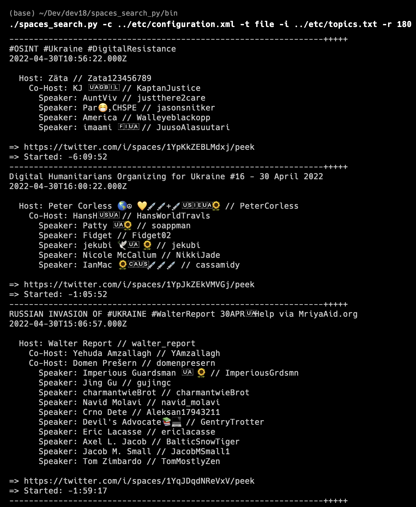
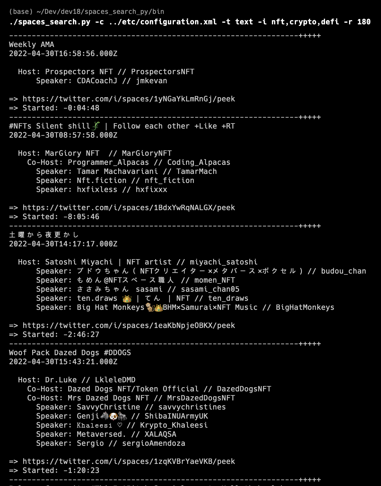

# spaces_search_py

## Configuration
- set absolute paths for bin, etc, lib, work
- set bearer_token (twitter_api v2)

## Usage

./spaces_search.py -i [input] -t [file/text] -c [config] -r [rate]   

file mode:   
    -t = file.  
    -i = file_name   

  EX: -i ../etc/topics.txt   
 
text mode:  
 |  -t = text  
 |  -i = comma-delimited list, no spaces  
 |  
 |=> EX: -i nft,crypto,defi,web3

  
## Output

     

     

